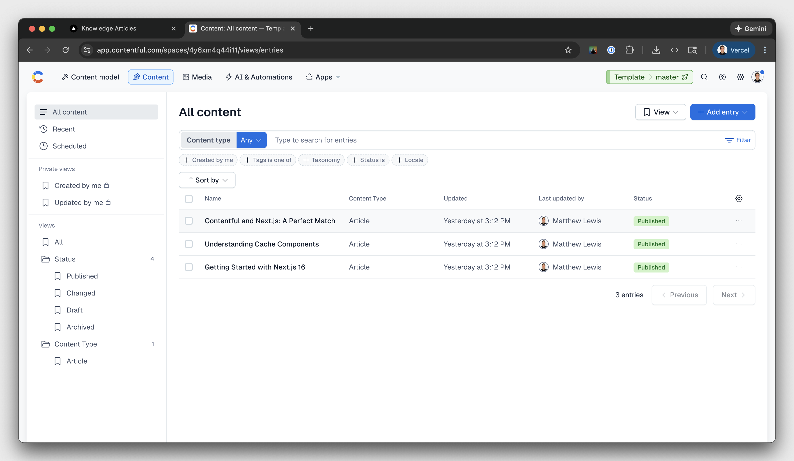
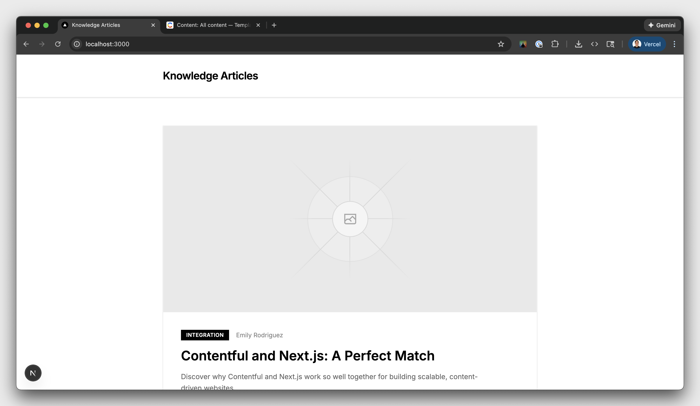
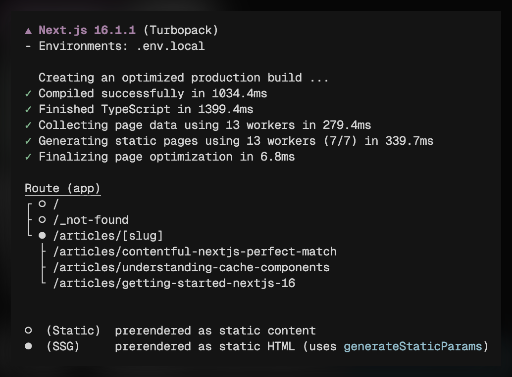

# Integrating Contentful with Next.js 16 Cache Components

Next.js 16 ships with Cache Components: a way to control caching at the component level instead of per route. Pair that with Contentful and you can serve content instantly from the edge, while still reflecting updates right after an editor hits Publish.

Here’s the tension most content teams run into:

- If you render dynamically, you get fresh content, but you pay for it on every request.
- If you render statically, you get speed, but publishes do not show up until you rebuild.
- If you try to bolt on workarounds, you usually push complexity to the client or lose the benefits of caching.

Cache Components exist to break that tradeoff. You cache the parts that should be stable (Contentful content) and keep the parts that must be live (views, personalization, pricing, inventory) dynamic, on the same page.

This guide walks through the three rendering strategies you can use in Next.js. The goal is to teach the why and the how behind Cache Components.

1. **Dynamic rendering** - Fresh content, slower pages
2. **Static rendering** - Fast pages, stale content
3. **Mixed (Cache Components)** - Fast and fresh

The full source lives on GitHub and this guide starts from the `dynamic` branch:
[https://github.com/vercel-labs/template-contentful-next](https://github.com/vercel-labs/template-contentful-next)

---

## Prerequisites

- Contentful account: [https://www.contentful.com/sign-up/](https://www.contentful.com/sign-up/)
- Vercel account: [https://vercel.com/signup](https://vercel.com/signup)
- Node.js 18.17+
- `pnpm`
- Redis (optional)

---

## Setup

We start with a fully dynamic version of the site. Then we add static generation and call out the tradeoffs. Finally, we turn on Cache Components to get the best of both.

### 1. Clone the starter

```bash
npx create-next-app@latest my-contentful-app --example "https://github.com/vercel-labs/template-contentful-next/tree/dynamic"
cd my-contentful-app
```

### 2. Run the setup wizard

```bash
pnpm setup-contentful
```

The wizard creates a Contentful space, configures your content model, and writes credentials to `.env.local`.

If you hit issues with the wizard, follow the manual steps below.

<details>
<summary><strong>Manual setup</strong></summary>

If `pnpm setup-contentful` fails:

#### Create a Contentful space

Go to [https://app.contentful.com/spaces/new](https://app.contentful.com/spaces/new) and create an empty space.

#### Get API tokens

1. **Settings → API keys → Add API key**
2. Copy the **Space ID** and **Content Delivery API access token**
3. Go to CMA tokens and generate a personal token: [https://app.contentful.com/account/profile/cma_tokens](https://app.contentful.com/account/profile/cma_tokens)

#### Configure environment

Create `.env.local`:

```bash
CONTENTFUL_SPACE_ID=your_space_id
CONTENTFUL_ACCESS_TOKEN=your_delivery_token

# Optional (only needed for `pnpm setup-contentful`)
# Create one at: https://app.contentful.com/account/profile/cma_tokens
CONTENTFUL_MANAGEMENT_TOKEN=your_management_token
```

#### Create the content model

In **Content model → Add content type**, create **Article** with ID `article`:

| Field         | ID             | Type                | Required |
| ------------- | -------------- | ------------------- | -------- |
| Title         | `title`        | Short text          | Yes      |
| Slug          | `slug`         | Short text (unique) | Yes      |
| Summary       | `summary`      | Short text          | No       |
| Details       | `details`      | Rich text           | No       |
| Date          | `date`         | Date only           | No       |
| Article Image | `articleImage` | Media               | No       |
| Author Name   | `authorName`   | Short text          | No       |
| Category Name | `categoryName` | Short text          | No       |

#### Create content

Add at least one Article entry and publish it.

</details>

Once setup finishes, your Contentful space should look like this:



### 3. Start the development server

```bash
pnpm dev
```

Open [http://localhost:3000](http://localhost:3000) to see your Contentful-powered site. Your homepage should look like this:

<!--
  In Next.js, files in /public are served from the site root (so this image is at /images/start_dev.png).
  For Markdown previews (Cursor/GitHub), use a relative path into the repo.
-->



---

## Project structure

The starter has two routes:

- `app/page.tsx` - lists all articles
- `app/articles/[slug]/page.tsx` - renders a single article

All Contentful queries live in `lib/contentful/queries.ts`. That matters because we will change how we fetch data without rewriting the pages.

The app also includes a view counter. That is intentional. View counts change on every request, which creates tension with static rendering. We use this to show why Cache Components exist.

> Redis is optional. If you do not provide Redis, the app falls back to random view counts.

---

## Part 1: Dynamic rendering

Dynamic rendering is the simplest place to start. It also mirrors what many teams ship first: fetch on request, show the latest content, move on.

It works, until traffic grows or you realize most of your content does not change often.

### Homepage

```tsx
// app/page.tsx
export default function Home() {
  return (
    <main className="mx-auto max-w-4xl px-6 py-16">
      <Articles />
    </main>
  );
}
```

The homepage is basically one component: `<Articles />`. It calls `getArticles` to fetch all articles from Contentful.

Because `getArticles` runs without dynamic params, Next.js can treat this route as static by default. That sounds great, but the catch shows up on the article route.

### Article page

```tsx
// app/articles/[slug]/page.tsx
export default async function ArticlePage(props: { params: Promise<{ slug: string }> }) {
  return (
    <main className="mx-auto max-w-4xl px-6 py-16">
      <nav className="mb-12 flex items-center justify-between text-sm">
        <Link
          href="/"
          className="group inline-flex items-center gap-1.5 text-black/50 transition-colors hover:text-black"
        >
          <span className="transition-transform group-hover:-translate-x-0.5">←</span>
          <span>All articles</span>
        </Link>
        <Suspense fallback={<ViewsSkeleton />}>
          <Views params={props.params} />
        </Suspense>
      </nav>
      <Suspense fallback={<ArticleContentSkeleton />}>
        <ArticleContent params={props.params} />
      </Suspense>
    </main>
  );
}
```

`/articles/[slug]` depends on the dynamic param `[slug]`. That makes the route dynamic by default, so Next.js fetches from Contentful on every request.

### Views component

```tsx
// components/views.tsx
import { getViews } from "@/lib/redis";

type ViewsProps = {
  params: Promise<{ slug: string }> | { slug: string };
};

export function ViewsSkeleton() {
  return <span className="inline-block h-4 w-16 animate-pulse rounded-sm bg-black/10" />;
}

export async function Views({ params }: ViewsProps) {
  const resolvedParams = await params;
  // NOTE: `getViews()` uses Redis when `REDIS_URL` is set. Otherwise it returns a placeholder
  // value (so this template works without extra setup).
  const views = await getViews(resolvedParams.slug);

  return <span className="text-black/50 tabular-nums">{views.toLocaleString()} views</span>;
}
```

`Views` fetches the latest count from Redis. `TrackView` increments the count when the page loads.

### The problem

Dynamic rendering makes every request pay the full cost:

- Every page load hits Contentful’s API
- Time to first byte goes up
- You lose edge caching for content that barely changes
- You do redundant work at scale

If your content updates once a week, fetching it on every request is wasted effort.

---

## Part 2: Static rendering

So you try static generation. It is the obvious next step: cache the content once, serve it fast everywhere.

It works, until the first time someone publishes and expects the site to update.

To avoid refetching content that did not change, Next.js supports static generation via `generateStaticParams`. This pre-renders pages at build time instead of on every request.

### Generate static paths

Add this to the top of `app/articles/[slug]/page.tsx`:

```tsx
// app/articles/[slug]/page.tsx
export async function generateStaticParams() {
  const articles = await getArticles();
  return articles.map((article) => ({ slug: article.slug }));
}
```

Now run:

```bash
pnpm build
```

Next.js generates HTML for every article and serves it from the CDN.



### The problems

**Content updates require rebuilds.** An editor publishes an article and nothing changes until you redeploy. For content sites, that lag hurts.

**Dynamic features freeze.** The view counter locks in at build time. Every user sees the same stale number.

Yes, you can hydrate the counter on the client. But now you trade server simplicity for client complexity:

- Layout shift
- Hydration mismatches
- Extra API calls

### The wrong workaround

You might think: wrap the view counter in `unstable_cache()` with `revalidate: 0` so it stays fresh. It is technically possible:

```tsx
// lib/redis.ts
import { unstable_cache } from "next/cache";

export const getCachedViews = unstable_cache(
  async (slug: string) => {
    const views = await redis.get(`views:${slug}`);
    return views ?? 0;
  },
  ["views"],
  {
    tags: ["views"],
    revalidate: 0, // Cache expires immediately
  }
);

// components/views.tsx
export async function Views({ slug }: { slug: string }) {
  const views = await getCachedViews(slug);
  return <span>{views} views</span>;
}
```

This defeats the purpose. `revalidate: 0` means the cache expires immediately, so every request still triggers a fetch. You pay for caching infrastructure and get zero caching benefit.

You also add complexity:

- You wrap every data function in `unstable_cache()`
- You define and coordinate tags manually
- You handle tag collisions across data sources
- You debug cache misses with limited visibility

Most importantly, you still cannot mix strategies on the same route. Contentful content wants to cache for minutes or hours. Views want to update every request. Page-level caching forces you to pick one.

Static rendering is all-or-nothing. You cannot keep one part static while another part stays dynamic.

---

## Part 3: Cache Components

This is exactly the gap Cache Components fill: different cache policies on the same page, without pushing your dynamic pieces to the client.

Cache Components let you mix cached and dynamic content on the same page using partial prerendering. The static parts serve instantly from cache. The dynamic parts stream in at request time.

### Enable Cache Components

```ts
// next.config.ts
const nextConfig = {
  cacheComponents: true,

  // ...the rest of your config
} satisfies NextConfig;

export default nextConfig;
```

With `cacheComponents` enabled, async components that fetch data must either:

- Use `"use cache"` so they can run inside the cached shell
- Or wrap in `<Suspense>` so they stream at request time

If you do neither, Next.js throws an error like: `Uncached data was accessed outside of <Suspense>.`

That constraint forces you to be explicit about caching intent.

### Cache home page content

Let's begin by adding caching to our home page. We can easily add the `use cache` directive to the top of our `<Articles />` component.

```jsx
async function Articles() {
  "use cache";
  const articles = await getArticles();

  // the rest our our component remains unchanged
}
```

The content on your home page may or may not need to change frequently based on your use case. That is why Next.js also allows you use `cacheLife` to configure the cache policy that works best for you. If none is provided Next.js will use the default profile. You can learn more about these profiles [here](https://nextjs.org/docs/app/api-reference/functions/cacheLife#preset-cache-profiles).

### Mix cached and dynamic content

Our article detail page uses dynamic data in the `<Views>` component, and static content in the `<ArticleContent>` component. Cache Components makes it easy to mix these strategies on a single page. Start by removing the `<Suspense>` boundary around the `ArticleContent` component.

```jsx
// app/articles/[slug]/page.tsx
export default async function ArticlePage(props: { params: Promise<{ slug: string }> }) {
  return (
    <main className="mx-auto max-w-4xl px-6 py-16">
      <nav className="mb-12 flex items-center justify-between text-sm">
        <Link
          href="/"
          className="group inline-flex items-center gap-1.5 text-black/50 transition-colors hover:text-black"
        >
          <span className="transition-transform group-hover:-translate-x-0.5">←</span>
          <span>All articles</span>
        </Link>
        <Suspense fallback={<ViewsSkeleton />}>
          <Views params={props.params} /> {/* Fetches per request, streams in */}
        </Suspense>
      </nav>
        <ArticleContent params={props.params} /> {/* Cached via "use cache" */}
    </main>
  );
}
```

Now if you run your development server you will see this error: `Data that blocks navigation was accessed outside of <Suspense>`. This is Next.js way of warning us that that we are accessing dynamic data incorrectly. To fix this, we can add `use cache` to our `<ArticleContent>` component which tells Next.js that we want to cache this component.

```jsx
async function ArticleContent(props: { params: Promise<{ slug: string }> }) {
  "use cache";
  const params = await props.params;

  const article = await getArticles({
    "fields.slug": params.slug,
    limit: 1,
  });

  // the rest of our component remains unchanged
}
```

We also want to support on-demand revalidation for our article content. This allows us to revalidate cache tags when a user hits `Publish` inside of Contentful. Before Cache Components we had to define all of our cache tags _before_ fetching our content, but with the new `cacheTag` API we can call it _afterwards_. This is a huge win for developers. We can:

1. Fetch our content
2. Create a unique cache tag based on the response
3. Create a simple revalidate function to handle webhhooks

Let's add a cache tag to the `ArticleContent` based on the `sys.id` of Contentful entry. This ID is a unique value assigned to every piece of content in Contentful. We purposefully choose this value over the `slug` since you may run into a scenario where you want to change the `slug` or add redirects. Next.js recommends pairing on-demand revalidation with the `'max'` cache profile for best performance.

```jsx
async function ArticleContent(props: { params: Promise<{ slug: string }> }) {
 "use cache";
  const params = await props.params;

  const articles = await getArticles({
   "fields.slug": params.slug,
    limit: 1,
  });

  if (!articles || articles.length === 0) {
    notFound();
  }

  cacheTag(articles[0].id);
  cacheLife("max");

  // the rest of our component remains unchanged
}
```

> Note: If a slug was not pre-rendered at build time, Next.js can still generate it on-demand and cache it (ISR-style).

What you get:

- The static shell (navigation and layout) renders instantly
- `Views` stays dynamic and streams in because it sits inside `<Suspense>`
- `ArticleContent` resolves from cache with no extra wrappers

Quick recap of the win:

- Cache Contentful content with `"use cache"`
- Stream truly dynamic bits with `<Suspense>`
- Invalidate by entry ID with `cacheTag()`

The view counter works. Content stays fast. You do not trade off freshness for speed.

---

## On-demand revalidation

When content changes in Contentful, invalidate the cache. Use Contentful webhooks to notify your app about publish events. The webhook payload includes the entry `sys.id`, which you can use to invalidate any cached data tagged with that ID.

Protect the endpoint with a secret.

### Create a revalidation secret

```bash
openssl rand -base64 32
```

Add it to `.env.local`:

```bash
CONTENTFUL_REVALIDATE_SECRET=your-generated-secret
```

### Add the webhook endpoint

```ts
// app/api/contentful/revalidate/route.ts
import { revalidateTag } from "next/cache";
import { NextRequest, NextResponse } from "next/server";

export async function POST(request: NextRequest) {
  const secret = request.headers.get("x-vercel-reval-key");

  if (secret !== process.env.CONTENTFUL_REVALIDATE_SECRET) {
    return NextResponse.json({ message: "Unauthorized" }, { status: 401 });
  }

  const body = await request.json();
  const entryId = body?.sys?.id;

  if (!entryId || typeof entryId !== "string") {
    return NextResponse.json({ message: "Missing or invalid entry ID" }, { status: 400 });
  }

  revalidateTag(entryId, "max");

  return NextResponse.json({ revalidated: true, entryId });
}
```

`revalidateTag(entryId, 'max')` marks cached data tagged with that entry ID as stale. The next request can serve stale content immediately while fetching fresh data in the background, which gives you stale-while-revalidate behavior.

### Configure the Contentful webhook

1. **Settings → Webhooks → Add webhook**
2. **URL:** `https://your-domain.vercel.app/api/contentful/revalidate`
3. **Headers:** `x-vercel-reval-key: your-secret`
4. **Triggers:** Publish, Unpublish
5. **Save**

Now when you publish in Contentful, your `/api/contentful/revalidate` route invalidates the right cache entries and updates the site immediately.

---

## Commit all changes

```bash
git add .
git commit -m "Add Cache Components"
git push origin main
```

Import the project on Vercel: [https://vercel.com](https://vercel.com)

Add these environment variables:

- `CONTENTFUL_SPACE_ID`
- `CONTENTFUL_ACCESS_TOKEN`
- `CONTENTFUL_REVALIDATE_SECRET`
- `REDIS_URL` (optional)

Deploy.

> After you deploy, update the Contentful webhook URL to point at your Vercel domain.

---

## Summary

You migrated a fully dynamic site to Cache Components. You now get granular cache invalidation and strong performance without sacrificing freshness.

| Approach         | Speed | Freshness | Dynamic features |
| ---------------- | ----- | --------- | ---------------- |
| Dynamic          | Slow  | Fresh     | Work             |
| Static           | Fast  | Stale     | Broken           |
| Cache Components | Fast  | Fresh     | Work             |

Cache Components eliminate the false choice between performance and freshness. Users get edge speed, editors get instant publishes, and you stop living on the rebuild treadmill.

To learn more about Next.js and Cache Components, visit [https://nextjs.org](https://nextjs.org).
